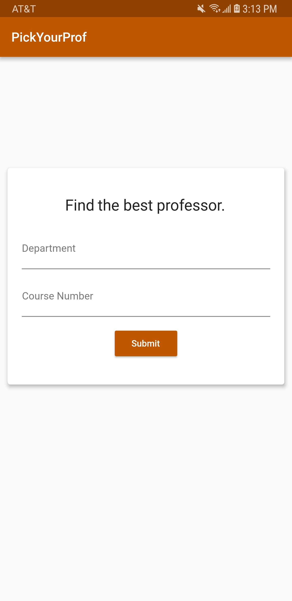
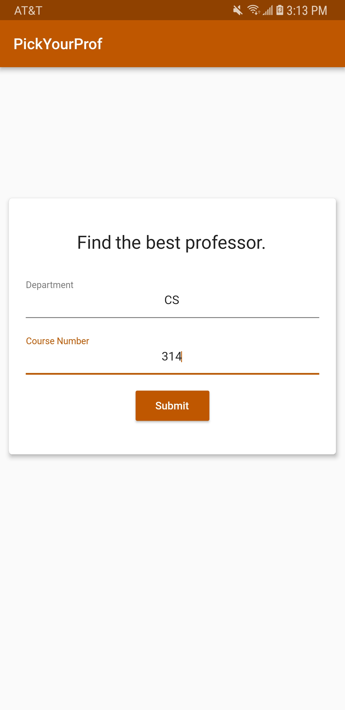
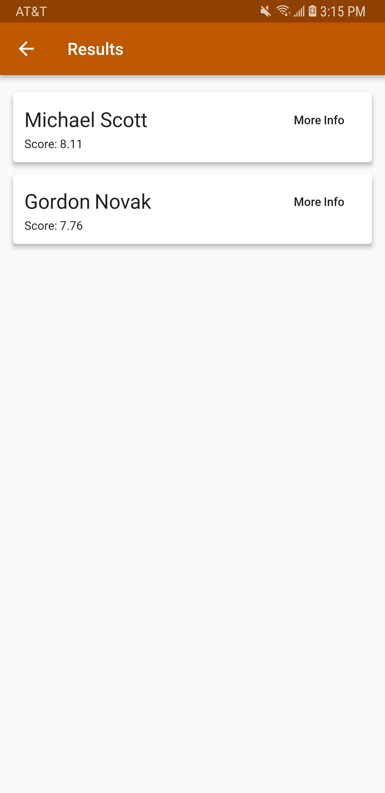
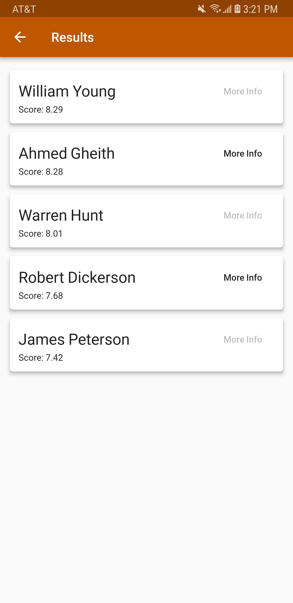

# PickYourProf-App
An app written in Flutter that personalizes professor choices (port of Node.js app)

Ported from https://github.com/sandeepnamburi/PickYourProf

## Screenshots

### What it does
Pick My Prof analayzes the UT directory of professors and gives your recommendations for professors based on Rate My Professor ratings and university reviews. It currently works for every single course and professor in the UT Austin database.

### How it works
Once the user enters a course, the program gets the list of professors who teach the course and the distribution of grades
for each professor for the given course. Then, it scrapes RateMyProfessors in order to get the overall quality, difficulty, average sentiment of comments, and percentage of students who would take a course by the professor again for each of the professors in the list.

With this data, the algorithm normalizes the overall quality, difficulty, average sentiment, and take again percentage to be out of 5, with 5 being the best. The algorithm then does a weight average of the metrics and adds it to the average GPA of a student taking a course with the professor, to get the PickYourProf score, which is on a scale from 0 to 10.
